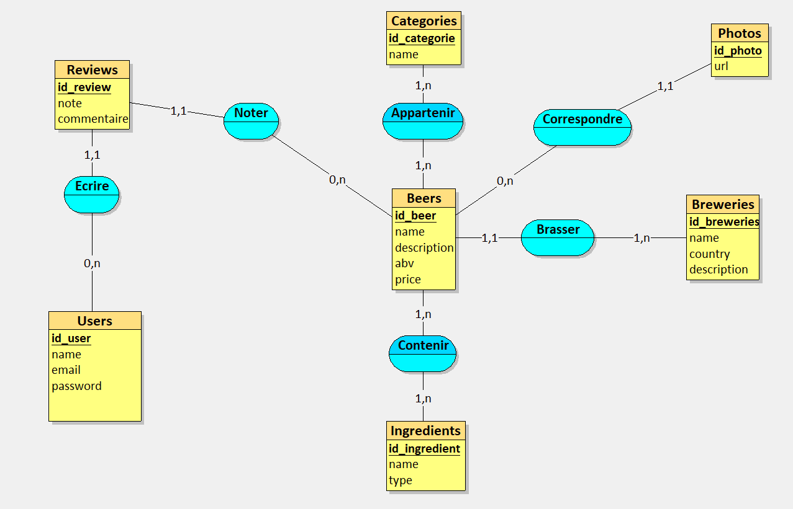

# Compte Rendu du projet de Mounir

Repository de Mounir : [Github](https://github.com/2024-devops-alt-dist/zythologue-MG)

## Modèle Merise



### Positif

- Les tables principales sont présentes
- Les relations entre les tables sont notées par des verbes d'action
- Les primary key sont soulignées

### Négatif

- Il manque la table `favorites` qui permet à un utilisateur de liker une bière.
- Les autres modèles MLD et MPD ne sont pas présents.

## Docker Compose 

Voici le docker-compose du projet de mounir

```yaml
version: "3.8"
services:
  db:
    image: postgres:latest
    container_name: beer_db
    environment:
      POSTGRES_USER: beer_user
      POSTGRES_PASSWORD: beer_password
      POSTGRES_DB: beer_db
    ports:
      - "5432:5432"
    volumes:
      - db_data:/var/lib/postgresql/data
volumes:
  db_data:
```

### Positif

- Récupération de la dernière version de postgre
- Les variables d'environnement sont bien définies
- Le port postgresql `5432` est bien exposé
- Le volume est bien créé et au bon endroit
- Les données sont persistées

### Négatif

- Le script de création des tables n'est pas lancé au démarrage
- Pas de jeu de données dans la base

## Création de tables (init.sql)

Exemple avec la création de la table `Users` :

```sql
CREATE TABLE Users (
    id_user INT PRIMARY KEY AUTO_INCREMENT,
    name VARCHAR(50) NOT NULL,
    email VARCHAR(100) NOT NULL UNIQUE,
    password VARCHAR(255) NOT NULL
);
```

### Positif

- Les informations générales sont présentes
- Les VARCHAR utilisés limitent le nombre de caractères pour plus d'optimisation
- L'email est UNIQUE pour gérer l'inscription / connexion de l'utilisateur

### Négatif

- l'id_user en `AUTO_INCREMENT` : Langage MySQL, ne convient pas à du postgres. Doit être utilisé : `SERIAL`
- Le nombre de caractère du mot de passe risque d'être trop faible si on veut le hasher dans la base de données.

De manière générale, les tables ont été conçues en MySQL et non Postgre. Je ne peux donc pas les générer sur le container créé avec le Docker-Compose.

## Requêtes SQL

``` SQL
SELECT c.name, COUNT(*) AS nombre_bieres
FROM Categories c
JOIN Beer_Category bc ON c.id_categorie = bc.id_categorie
GROUP BY c.name;
```

Malheureusement je ne peux pas tester les requêtes.